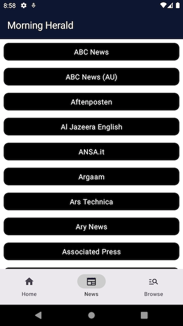

### Morning Herald: A Jetpack Compose MVVM Project

### Core Features

- **Dynamic News Articles Fetching:** Integrates with [NewsAPI.org](https://newsapi.org/docs/endpoints/sources) to retrieve news articles based on different sources.
- **Bottom Navigation Interface:** Facilitates easy navigation between the Home screen, News by Source, and Browse sections.
- **Offline Capability:** Allows for reading news articles even when offline, enhancing accessibility
- **Pagination:** Implements pagination for better management and loading of news articles.
- **Unit Testing:** Ensures reliability and stability through thorough unit tests.

### Leveraged Libraries & Technologies
- **MVVM Architecture**: For a scalable, maintainable app structure.
- **Kotlin**: The primary language offering concise syntax and powerful features.
- **Jetpack Compose**: For building dynamic UIs with less boilerplate code.
- **Dagger Hilt**: Simplifies dependency injection, streamlining the development process.
- **Coroutines & Flow**: For efficient asynchronous programming and real-time data streaming.
- **Retrofit & OkHttp**: Powers network operations with easy-to-use HTTP request methods.
- **StateFlow**: For seamlessly updating and managing UI content based on data state changes.
- **Pagination**: Facilitates smooth data loading and scrolling experiences.
- **Coil**: An image loading library specifically designed for Compose.
- **Room**: Manages local database storage for offline access to news articles.
- **Kotlin DSL**: Utilized in Gradle for script writing, enhancing build configurations.
- **Mockk**: A Kotlin-focused mocking library for effectively unit testing.

### Planned Upgrades
- Refactoring and enhancing code base for further improvization.
- Filter News by Country and Language: To provide a more personalized news reading experience.
- Background Sync with WorkManager: To periodically update news articles in the background.
- Extended Offline Support: Aiming for offline functionality across all pages for uninterrupted news access.

### Screen Shots

